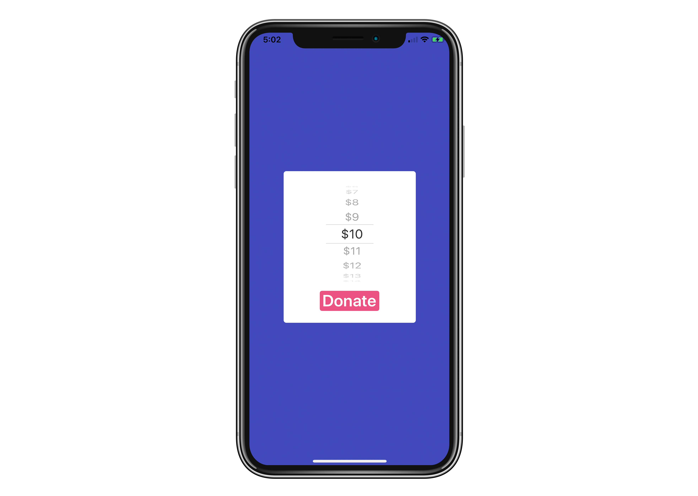

# OpenDonation
An Open Source donation app for iOS making use of the [Square](https://squareup.com) card reader.



## Settings

Open `ViewController.swift` and edit the values:

```Swift
private var donationValue: Int = 5
private var minimumDonationValue = 5
private var maximumDonationValue = 99
```

## Register your app

Don’t forget to register your app under your Square dev account: <https://connect.squareup.com/apps>

You’ll need your package name: `com.company.opendonation`

And the URL Scheme: `opendonation`

```bash
$ keytool -list -v -keystore ~/.android/debug.keystore -alias androiddebugkey -storepass android -keypass android
```

Full instructions: <https://docs.connect.squareup.com/payments/pos/setup-ios>

## Secrets

Your `API_CLIENT_ID` is stored in `Constant.swift`.

Rename `Constant.example.swift` to `Constant.swift` and add your ID:

```Swift
static let API_CLIENT_ID = “your-id”
```

### Credits
Idea by [Ashleigh Hull](https://github.com/ashleyhull-versent).

Open Donation logo by [simpvi](https://dribbble.com/shots/2440309-O-D#comment-7451838).